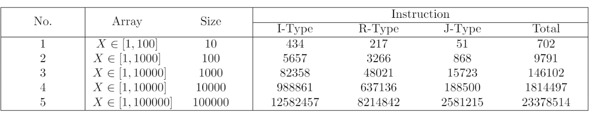

<!-- icons  -->
[1.1]: https://img.shields.io/badge/GitHub-100000?style=for-the-badge&logo=github&logoColor=white
[2.1]: https://img.shields.io/badge/LinkedIn-0077B5?style=for-the-badge&logo=linkedin&logoColor=white
[3.1]: https://img.shields.io/badge/Medium-12100E?style=for-the-badge&logo=medium&logoColor=white
[4.1]: https://img.shields.io/badge/Twitter-1DA1F2?style=for-the-badge&logo=twitter&logoColor=white

<!-- links to your social media accounts -->
[1]: https://github.com/produdez
[2]: https://www.linkedin.com/in/produdez/
[3]: https://medium.com/@produde
[4]: https://twitter.com/_Produde_

# Assembly Course Assignment

    

**Description:**

This repository contains all labs from my assembly class. Including code and report for my assignment: `Implement binary search and quick sort using ASM`

I'll describe the assignment a bit more in this `README` file.

Detailed report of the assignment is [here](https://github.com/produdez/Assembly-CA-201/blob/master/Assignment/FinalWork/Report/report_mips.pdf)

## General Information

- Implemented binary sort, quick sort (pivot last elem)
- Tested performance using MAR MIPS built in benchmarking tool
- Quick sort was tested on worse case (already sorted array) and normal case (random array)
- Extra notes and remarks in report

## Screenshots

1. Quick sort benchmark
   | Worse Case | Normal case |
   |-|-|
   |||
2. Binary search result for input: (note that the array is sorted before asking for binary search input)

   

## Contact

Created by [@produdez](https://github.com/produdez) - feel free to contact me or follow my blog on medium ❤️!

<!-- [![alt text][1.1]][1] -->
[![alt text][2.1]][2]
[![alt text][3.1]][3]
[![alt text][4.1]][4]
